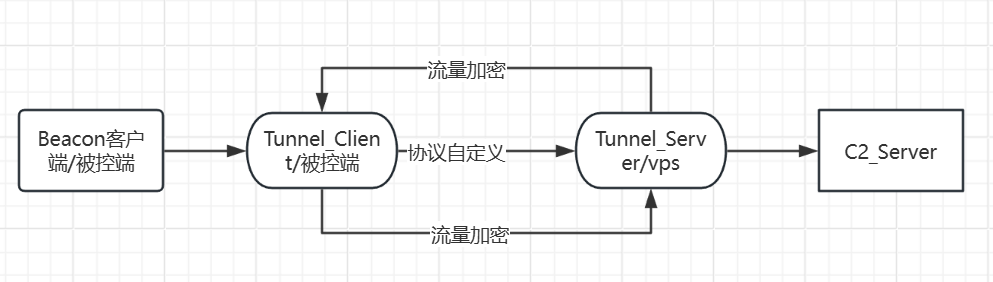
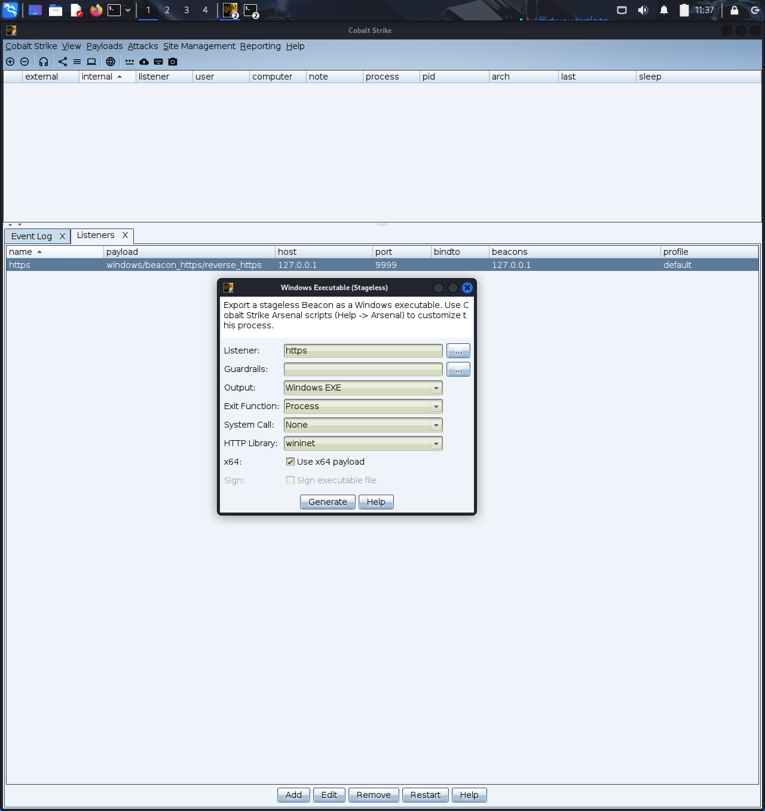
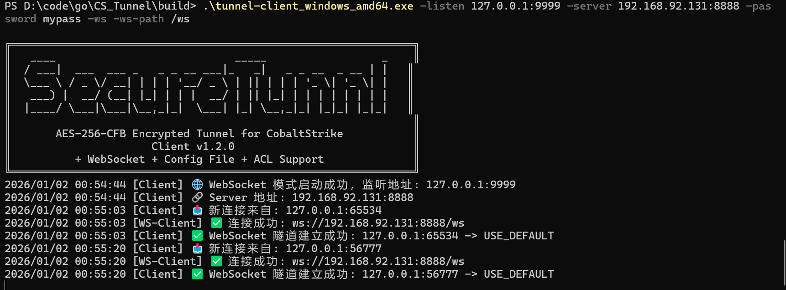
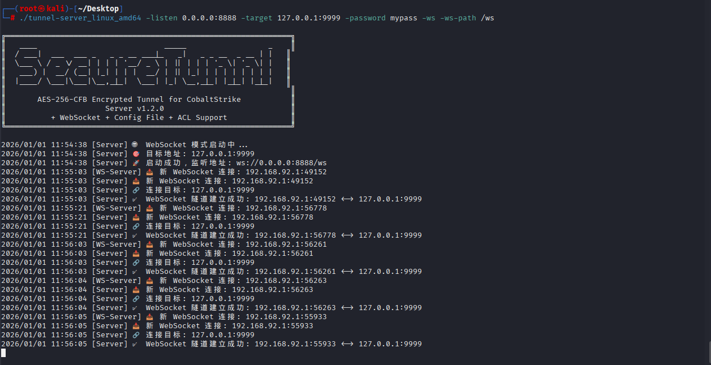
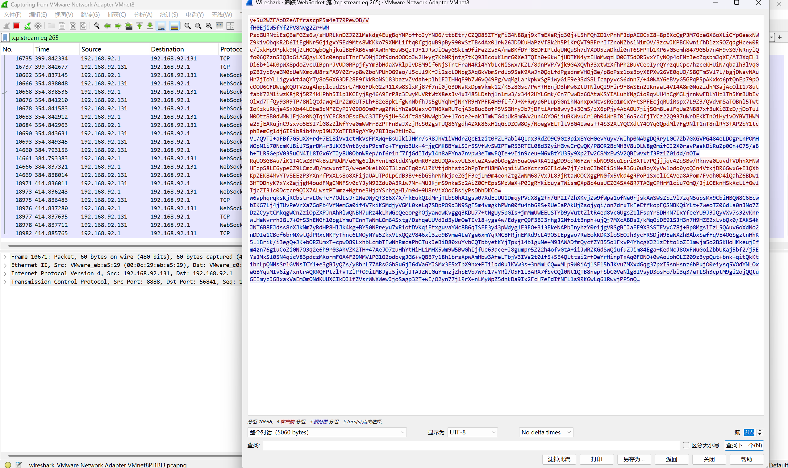
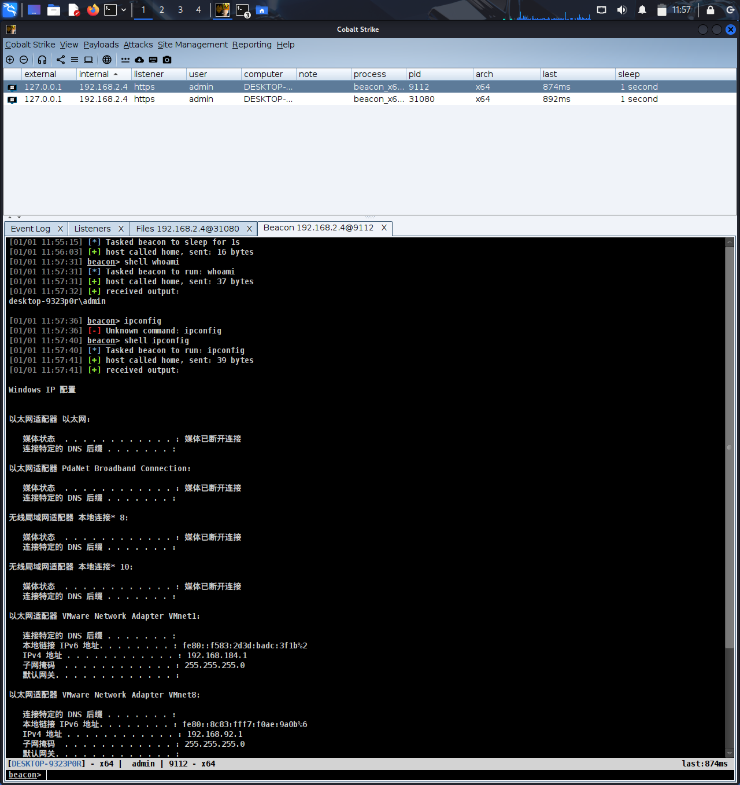

# SecureTunnel - AES-256-CFB 加密隧道

> 一个基于 Go 语言的安全隧道工具，专为 CobaltStrike 等 C2 框架设计。通过多层加密和流量伪装技术，有效隐藏 C2 服务器真实地址，防止 DDoS 攻击，提供 ACL 访问控制，实现流量加密包装，确保通信安全与隐蔽性。

---

## 📋 目录

- [功能特点](#-功能特点)
- [架构设计](#-架构设计)
- [快速开始](#-快速开始)
- [使用示例](#-使用示例)
- [配置说明](#-配置说明)
- [参数列表](#-参数列表)
- [项目结构](#-项目结构)
- [安全说明](#️-安全说明)

---

## ✨ v1.4.0 新功能

- 🔧 **ACL 混合模式** - 支持黑白名单同时生效（黑名单优先），更灵活的访问控制
- ⚡ **短参数别名** - 支持 `-l`、`-t`、`-s`、`-p`、`-d`、`-q`、`-v`、`-h` 等短参数，使用更便捷
- 🐛 **Bug 修复** - 修复 daemon 模式无限循环、半关闭连接处理、配置文件删除时序等问题
- 🚀 **性能优化** - TCP 连接调优、buffer 复用池、WebSocket 优雅关闭

## ✨ v1.3.0 功能

- 📝 **日志记录** - 支持将日志输出到文件，支持静默模式
- 🔇 **后台运行** - 支持后台运行模式，不显示终端窗口，适合生产环境
- 🎯 **代码优化** - 移除所有装饰性输出（emoji、banner），简化日志信息，提升专业性
- 📄 **配置文件支持** - 支持 YAML/JSON 配置文件，启动后可自动删除
- 🛡️ **IP 黑白名单** - Server 端支持 IP/CIDR 访问控制
- 🔒 **安全删除** - 配置文件覆写后删除，防止恢复

---

## 📋 功能特点

### 🔐 加密与安全
- **AES-256-CFB 加密** - 所有传输数据均经过 AES-256-CFB 加密，确保数据安全
- **双向加密传输** - 请求和响应均加密传输，端到端保护
- **流量加密包装** - 多层加密包装，隐藏真实通信内容
- **随机 IV 机制** - 每个数据包使用随机 IV，防止流量分析

### 🛡️ 防护与隐蔽
- **隐藏 C2 服务器地址** - 通过代理隧道完全隐藏真实 C2 服务器 IP，防止直接暴露
- **防止 DDoS 攻击** - 通过中间代理层，有效隔离和防护 C2 服务器免受直接攻击
- **ACL 访问控制** - Server 端支持 IP/CIDR 黑白名单，精确控制访问来源
- **流量伪装** - 支持 WebSocket 协议，将 C2 流量伪装成正常 Web 流量

### 🌐 传输模式
- **HTTPS CONNECT 代理** - 支持 HTTP/HTTPS CONNECT 代理模式
- **WebSocket 传输** - 支持 WS/WSS 协议，流量更隐蔽，难以被检测
- **TLS 加密传输** - 支持 WebSocket + TLS (WSS)，提供额外加密层

### ⚙️ 配置与管理
- **配置文件支持** - 支持 YAML/JSON 配置，启动后自动删除
- **安全删除** - 配置文件覆写后删除，防止数据恢复
- **日志记录** - 支持将日志输出到文件，便于审计和调试
- **后台运行** - 支持后台运行模式，适合生产环境部署
- **静默模式** - 支持静默模式，不输出到终端，仅记录到日志文件
- **高并发支持** - 基于 Go 协程，支持大量并发连接
- **跨平台** - 支持 Windows、Linux、macOS

---

## 🏗️ 架构设计



**工作流程：**

1. Owner Client (Beacon) 连接到本地 Proxy Client
2. Proxy Client 将流量加密包装后转发到 Proxy Server (VPS)
3. Proxy Server 解密后转发到 Owner Server (TeamServer)
4. 响应数据按相反方向加密传输

**安全优势：**

- ✅ **隐藏真实地址** - C2 服务器真实 IP 完全隐藏，只暴露 VPS 代理地址
- ✅ **DDoS 防护** - 攻击者只能攻击 VPS 代理层，无法直接攻击 C2 服务器
- ✅ **流量加密** - 所有流量经过 AES-256-CFB 加密，即使被截获也无法解密
- ✅ **访问控制** - 通过 ACL 精确控制哪些 IP 可以连接，防止未授权访问

---

## 🚀 快速开始

### 编译项目

```bash
# 使用构建脚本（推荐）
# Windows:
build.bat

# Linux/macOS:
./build.sh

# 手动编译 Server
go build -ldflags="-s -w" -o tunnel-server.exe ./cmd/server

# 手动编译 Client
go build -ldflags="-s -w" -o tunnel-client.exe ./cmd/client

# 交叉编译 Linux
GOOS=linux GOARCH=amd64 go build -ldflags="-s -w" -o tunnel-server_linux ./cmd/server
GOOS=linux GOARCH=amd64 go build -ldflags="-s -w" -o tunnel-client_linux ./cmd/client
```

### 快速启动

**Server 端：**
```bash
# 使用短参数（推荐）
./tunnel-server -l 0.0.0.0:8888 -t 127.0.0.1:50050 -p "YourPass"

# 或使用完整参数
./tunnel-server -listen 0.0.0.0:8888 -target 127.0.0.1:50050 -password "YourPass"
```

**Client 端：**
```bash
# 使用短参数（推荐）
./tunnel-client -l 127.0.0.1:443 -s vps.example.com:8888 -p "YourPass"

# 或使用完整参数
./tunnel-client -listen 127.0.0.1:443 -server vps.example.com:8888 -password "YourPass"
```

### 后台运行和日志记录

**后台运行并记录日志：**
```bash
# Server 端后台运行（使用短参数）
./tunnel-server -l 0.0.0.0:8888 -t 127.0.0.1:50050 -p "YourPass" \
  -d -log /var/log/tunnel-server.log -q

# Client 端后台运行（使用短参数）
./tunnel-client -l 127.0.0.1:443 -s vps.example.com:8888 -p "YourPass" \
  -d -log /var/log/tunnel-client.log -q
```

**仅记录日志（不后台运行）：**
```bash
# 输出到终端和日志文件
./tunnel-server -l 0.0.0.0:8888 -t 127.0.0.1:50050 -p "YourPass" \
  -log /var/log/tunnel-server.log

# 仅记录到日志文件（静默模式）
./tunnel-server -l 0.0.0.0:8888 -t 127.0.0.1:50050 -p "YourPass" \
  -log /var/log/tunnel-server.log -q
```

---

## 📖 使用示例

### 场景：CobaltStrike 隧道配置

#### 1. CobaltStrike 监听器配置

在 CobaltStrike 中创建 HTTP 监听器，配置为本地地址：

```
监听地址: 127.0.0.1:9999
```



#### 2. Client 端配置

启动 Client 端，监听本地 443 端口，连接到 VPS 的 Server：

```bash
./tunnel-client -l 127.0.0.1:443 -s vps.example.com:8888 -p "YourPass" -ws
```



#### 3. Server 端配置

在 VPS 上启动 Server 端，监听 8888 端口，转发到本地 TeamServer：

```bash
./tunnel-server -l 0.0.0.0:8888 -t 127.0.0.1:50050 -p "YourPass" -ws
```



#### 4. 流量分析

**网络流量侧：** 所有流量均为 WebSocket 协议，与 CobaltStrike 原始流量完全无关，有效规避流量检测。



**CobaltStrike 侧：** 功能一切正常，Beacon 正常上线，所有功能均可正常使用。



---

## 📄 配置说明

### 配置文件模式

#### 生成示例配置

```bash
# Server 端生成配置
tunnel-server -gen-config server.yaml

# Client 端生成配置
tunnel-client -gen-config client.yaml
```

#### 使用配置文件启动

```bash
# 普通启动
tunnel-server -config server.yaml
tunnel-client -config client.yaml

# 启动后删除配置文件
tunnel-server -config server.yaml -delete-config
tunnel-client -config client.yaml -delete-config

# 安全删除配置文件（覆写后删除，防止数据恢复）
tunnel-server -config server.yaml -secure-delete
tunnel-client -config client.yaml -secure-delete
```

#### 配置文件示例

**Server 配置 (server.yaml):**

```yaml
mode: server

server:
  listen: "0.0.0.0:8888"
  target: "127.0.0.1:50050"
  password: "YourSecurePassword@2024"
  
  # WebSocket 配置
  enable_ws: false
  ws_path: "/ws"
  ws_tls: false
  ws_cert: ""
  ws_key: ""
  
  # 访问控制
  acl:
    enable: true
    mode: "both"  # whitelist/blacklist/both (both=同时生效,黑名单优先)
    whitelist:
      - "192.168.1.0/24"
      - "10.0.0.0/8"
      - "127.0.0.1"
    blacklist:
      - "192.168.1.100"  # 即使在白名单范围内也会被拒绝
  
  # 日志和运行模式
  log_path: "/var/log/tunnel-server.log"  # 日志文件路径（可选）
  daemon: false  # 后台运行模式
  quiet: false   # 静默模式，不输出到终端
```

**Client 配置 (client.yaml):**

```yaml
mode: client

client:
  listen: "127.0.0.1:443"
  server: "vps.example.com:8888"
  password: "YourSecurePassword@2024"
  enable_https: false
  
  # WebSocket 配置
  enable_ws: false
  ws_path: "/ws"
  ws_tls: false
  ws_skip_verify: false
  
  # 日志和运行模式
  log_path: "/var/log/tunnel-client.log"  # 日志文件路径（可选）
  daemon: false  # 后台运行模式
  quiet: false   # 静默模式，不输出到终端
```

---

## 🛡️ IP 访问控制 (ACL)

Server 端支持基于 IP 的访问控制，支持白名单、黑名单和混合三种模式。

### 白名单模式

只允许名单内的 IP 连接：

```bash
tunnel-server -l 0.0.0.0:8888 -t 127.0.0.1:50050 -p mypass \
  -acl -acl-mode whitelist -acl-whitelist "192.168.1.0/24,10.0.0.1,127.0.0.1"
```

### 黑名单模式

拒绝名单内的 IP 连接：

```bash
tunnel-server -l 0.0.0.0:8888 -t 127.0.0.1:50050 -p mypass \
  -acl -acl-mode blacklist -acl-blacklist "192.168.1.100,10.10.0.0/16"
```

### 混合模式 (v1.4.0 新增)

黑白名单同时生效，黑名单优先。即使 IP 在白名单中，如果同时在黑名单中也会被拒绝：

```bash
# 允许 10.0.0.0/8 网段，但拒绝其中的 10.1.1.100
tunnel-server -l 0.0.0.0:8888 -t 127.0.0.1:50050 -p mypass \
  -acl -acl-mode both -acl-whitelist "10.0.0.0/8" -acl-blacklist "10.1.1.100"
```

### 支持的格式

- **单个 IP**: `192.168.1.100`
- **CIDR 格式**: `192.168.1.0/24`
- **多个条目**: 用逗号分隔，如 `"192.168.1.0/24,10.0.0.1,127.0.0.1"`

---

## 📡 传输模式

### TCP 模式（传统加密隧道）

**Server 端：**
```bash
./tunnel-server -l 0.0.0.0:8888 -t 127.0.0.1:50050 -p "YourPass"
```

**Client 端：**
```bash
./tunnel-client -l 127.0.0.1:443 -s vps.example.com:8888 -p "YourPass"
```

### WebSocket 模式（流量伪装）

**Server 端：**
```bash
# 基础 WebSocket
./tunnel-server -l 0.0.0.0:80 -t 127.0.0.1:50050 -p "YourPass" \
  -ws -ws-path /api/stream

# WebSocket + TLS
./tunnel-server -l 0.0.0.0:443 -t 127.0.0.1:50050 -p "YourPass" \
  -ws -ws-tls -ws-cert cert.pem -ws-key key.pem
```

**Client 端：**
```bash
# 基础 WebSocket
./tunnel-client -l 127.0.0.1:443 -s vps.com:80 -p "YourPass" \
  -ws -ws-path /api/stream

# WebSocket + TLS
./tunnel-client -l 127.0.0.1:443 -s vps.com:443 -p "YourPass" \
  -ws -ws-tls -ws-skip-verify
```

### HTTPS CONNECT 代理模式

Client 端支持 HTTPS CONNECT 代理模式：

```bash
./tunnel-client -l 127.0.0.1:443 -s vps.example.com:8888 -p "YourPass" -https
```

---

## 🎯 版本更新说明

### v1.4.0 更新内容

1. **ACL 混合模式**
   - 新增 `both` 模式，支持黑白名单同时生效
   - 黑名单优先：即使 IP 在白名单中，如果同时在黑名单中也会被拒绝
   - 更灵活的访问控制策略

2. **短参数别名**
   - `-l` = `-listen`，`-t` = `-target`，`-s` = `-server`
   - `-p` = `-password`，`-d` = `-daemon`，`-q` = `-quiet`
   - `-v` = `-version`，`-h` = `-help`，`-c` = `-config`

3. **Bug 修复**
   - 修复 daemon 模式使用 `-d` 短参数时导致无限循环的问题
   - 修复半关闭连接处理，使用 `CloseWrite()` 正确关闭 TCP 连接
   - 修复配置文件删除与 daemon 模式的时序冲突问题
   - 修复 WebSocket 桥接连接未正确关闭的问题

4. **性能优化**
   - 使用 `sync.Pool` 复用 buffer，减少内存分配
   - TCP 连接调优：`SetNoDelay`、`SetKeepAlive` 优化网络性能
   - WebSocket ping goroutine 优雅关闭机制

### v1.3.0 更新内容

1. **移除装饰性输出**
   - 删除了所有 ASCII 艺术字 banner
   - 移除了所有 emoji 表情符号
   - 简化了所有日志输出文本
   - 使输出更加专业和简洁

2. **日志系统重构**
   - 实现了统一的日志管理模块
   - 支持同时输出到终端和文件
   - 支持静默模式，仅记录到日志文件
   - 日志格式统一，包含时间戳和微秒精度

3. **后台运行优化**
   - 修复了 daemon 模式的参数传递问题
   - 优化了 Windows 和 Unix 系统的后台运行实现
   - 确保后台进程可以正常终止
   - 支持通过配置文件启用后台运行

4. **代码质量提升**
   - 统一了所有模块的日志调用方式
   - 移除了冗余的装饰性代码
   - 提升了代码的可维护性

---

## 📖 参数列表

### Server 参数 (tunnel-server)

| 参数 | 简写 | 说明 | 默认值 | 必需 |
|------|------|------|--------|------|
| `-listen` | `-l` | 监听地址 | - | ✅ |
| `-target` | `-t` | 目标地址 (如 TeamServer) | - | ✅ |
| `-password` | `-p` | 加密密码 | SecureTunnel@2024 | ❌ |

### Client 参数 (tunnel-client)

| 参数 | 简写 | 说明 | 默认值 | 必需 |
|------|------|------|--------|------|
| `-listen` | `-l` | 本地监听地址 | - | ✅ |
| `-server` | `-s` | Server 端地址 | - | ✅ |
| `-target` | `-t` | 目标地址 (可选) | - | ❌ |
| `-password` | `-p` | 加密密码 | SecureTunnel@2024 | ❌ |
| `-https` | - | 启用 HTTPS CONNECT 代理 | false | ❌ |

### 配置文件参数

| 参数 | 简写 | 说明 |
|------|------|------|
| `-config` | `-c` | 配置文件路径 (JSON/YAML) |
| `-gen-config` | - | 生成示例配置文件 |
| `-delete-config` | - | 启动后删除配置文件 |
| `-secure-delete` | - | 安全删除 (覆写后删除) |

### 日志和运行模式参数

| 参数 | 简写 | 说明 | 默认值 |
|------|------|------|--------|
| `-log` | - | 日志文件路径 | - |
| `-daemon` | `-d` | 后台运行模式 | false |
| `-quiet` | `-q` | 静默模式，不输出到终端 | false |
| `-version` | `-v` | 显示版本信息 | - |
| `-help` | `-h` | 显示帮助信息 | - |

### WebSocket 参数

| 参数 | 说明 | 默认值 |
|------|------|--------|
| `-ws` | 启用 WebSocket | false |
| `-ws-path` | WebSocket 路径 | /ws |
| `-ws-tls` | 启用 TLS | false |
| `-ws-cert` | TLS 证书路径 | - |
| `-ws-key` | TLS 密钥路径 | - |
| `-ws-skip-verify` | 跳过证书验证 (Client) | false |

### ACL 参数 (Server)

| 参数 | 说明 | 默认值 |
|------|------|--------|
| `-acl` | 启用访问控制 | false |
| `-acl-mode` | 模式 (whitelist/blacklist/both) | both |
| `-acl-whitelist` | 白名单 (逗号分隔) | - |
| `-acl-blacklist` | 黑名单 (逗号分隔) | - |

---

## 🛡️ 安全说明

### 加密安全

- ✅ **强密码建议** - 请使用强密码（建议 16+ 字符，包含大小写字母、数字和特殊字符）
- ✅ **密钥派生** - 密码通过 SHA-256 哈希转换为 32 字节 AES 密钥
- ✅ **随机 IV** - 每个数据包使用随机 IV，确保相同明文产生不同密文
- ✅ **AES-256-CFB** - 使用 AES-256-CFB 模式，提供强加密保护
- ✅ **流量加密包装** - 多层加密包装，有效隐藏真实通信内容，防止流量分析

### 防护机制

- ✅ **隐藏 C2 地址** - 通过代理隧道架构，C2 服务器真实 IP 完全隐藏，只暴露 VPS 代理地址
- ✅ **DDoS 防护** - 攻击者只能攻击 VPS 代理层，无法直接定位和攻击真实的 C2 服务器
- ✅ **ACL 访问控制** - 通过 IP/CIDR 黑白名单精确控制访问来源，拒绝未授权连接
- ✅ **流量伪装** - WebSocket 模式将 C2 流量伪装成正常 Web 流量，降低被检测风险

### 配置安全

- ✅ **安全删除** - 使用 `-secure-delete` 参数可覆写后删除配置文件，防止数据恢复
- ✅ **自动删除** - 使用 `-delete-config` 参数可在启动后自动删除配置文件
- ✅ **访问控制** - 建议启用 ACL 白名单模式，只允许信任的 IP 连接

### 最佳实践

1. **密码管理**
   - 使用强密码，定期更换
   - 不要在代码或配置文件中硬编码密码
   - 使用配置文件时，启动后立即删除

2. **网络隔离**
   - Server 端启用 ACL 白名单模式
   - 限制 Server 端监听地址，避免暴露在公网
   - 使用防火墙规则进一步限制访问

3. **传输安全**
   - 生产环境建议使用 WebSocket + TLS (WSS)
   - 定期更新 TLS 证书
   - 避免使用自签名证书（如必须，确保证书安全）

4. **日志安全**
   - 注意日志中可能包含敏感信息
   - 定期清理日志文件
   - 避免在日志中记录密码等敏感信息
   - 使用 `-quiet` 模式可避免在终端输出敏感信息
   - 建议将日志文件存储在安全位置，并设置适当的文件权限

5. **后台运行**
   - 生产环境建议使用 `-daemon` 模式后台运行
   - 结合 `-log` 和 `-quiet` 参数，实现完全静默运行
   - 使用配置文件时，可在配置文件中设置 `daemon: true` 和 `quiet: true`
   - **Windows 系统终止后台进程：**
     ```bash
     # 终止单个进程
     taskkill /F /IM tunnel-server.exe
     
     # 终止进程树（推荐，可终止所有子进程）
     taskkill /F /T /IM tunnel-server.exe
     ```
   - **Linux 系统终止后台进程：**
     ```bash
     # 使用进程名终止
     pkill -f tunnel-server
     
     # 或使用 PID
     kill -9 <PID>
     ```

---

**⚠️ 免责声明：** 本工具仅供安全研究和合法授权测试使用。使用者需自行承担使用本工具所产生的所有法律责任。
